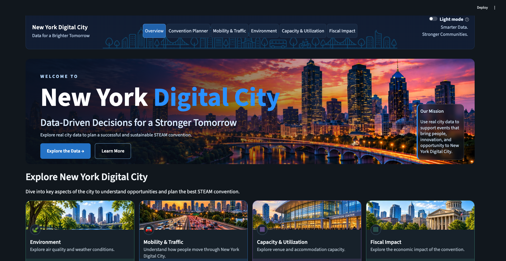

# SparkCity: New York Digital City

SparkCity is a data engineering capstone exploring how city data can inform planning for a large STEAM convention. The project combines PySpark data pipelines and validation with an interactive Streamlit dashboard for mobility, environment, capacity, fiscal impact, and convention planning.

The dashboard is a planning and analysis tool, not a live city operations system. Some views use shared PostgreSQL data; scenario outputs and projections include assumptions that should not be treated as confirmed forecasts or operational recommendations.

## Dashboard

- **Mobility & Traffic:** explore traffic patterns and convention-related scenarios.
- **Environment:** review air-quality and weather observations, current modeled conditions, and historical planning context.
- **Capacity & Utilization:** examine occupancy and infrastructure capacity using shared database data.
- **Fiscal Impact:** explore fiscal data and scenario analysis.
- **Convention Planner:** compare planning scenarios and their assumptions.

## Quick Start

### Requirements

- Python 3.13
- [uv](https://docs.astral.sh/uv/getting-started/installation/)
- Java 17 or 21 for PySpark workflows

Install dependencies and launch the app from the repository root:

```bash
uv python install 3.13
uv sync --dev
uv run streamlit run dashboard/app.py
```

Open the local URL printed by Streamlit, usually <http://localhost:8501>. PostgreSQL credentials are not needed to launch the app, but database-backed views require an approved connection; see [Setup.md](Setup.md).

Run the test suite with:

```bash
uv run pytest
```

## Project Layout

```text
dashboard/       Streamlit application, pages, components, and styles
data/            Reference data and local processed outputs
docs/            Model notes, workflows, and project documentation
notebooks/       Exploratory analysis and reproducible project workflows
scripts/         Database checks, dataset loading, and pipeline entry points
sql/             Database schema and analytics queries
src/sparkcityx/  Shared Python package and data engineering logic
tests/           Unit, integration, data, and dashboard checks
```

## Data and Safety

- Do not commit credentials, private datasets, or local environment files. Keep database credentials in the ignored `secrets/.env` file.
- Database schema changes and writes are explicit operations. Review the relevant workflow documentation and obtain team approval before applying them.
- Scenario results and projections document their assumptions and limits in the relevant pages under [`docs/`](docs/).

## Documentation

- [Local setup and database access](Setup.md)
- [Day 5 data pipeline and database workflow](docs/day5_workflow.md)
- [Convention planner dashboard and model boundaries](docs/convention_planner_dashboard.md)
- [Fiscal model](docs/fiscal_model.md)
- [Environment projection](docs/environment_projection.md)
